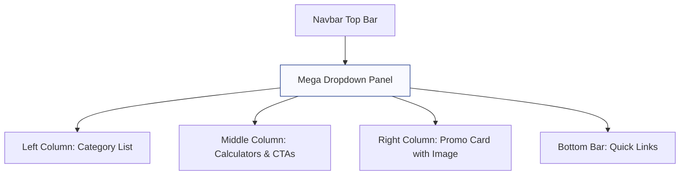

# Navbar Redesign Plan (Mega Dropdowns)

## Objective
Replace the current simple navbar with rich mega-dropdowns for **Loans**, **Insurance**, **Credit Cards**, and **Partner Zone** based on the provided user content and image reference.

The dropdown should have a 3-column layout:
- **Left**: Vertical list of loan/insurance/card types (clickable)
- **Middle**: Action buttons (Interest Rates, Eligibility Calculator, EMI Calculator, "Explore More", "Apply Now")
- **Right**: Promo card with heading, description, image, and "Avail Now" CTA (similar to the Axis Bank Personal Loan example)
- **Bottom**: Quick links like "TRACK YOUR APPLICATION", "TYPES OF ...", etc.

For **mobile**: All options collapse under the hamburger menu using accordions.

## New Top Navigation Structure
- Logo
- Home
- **Loans** (dropdown)
- **Insurance** (dropdown)
- **Credit Cards** (dropdown)
- **Partner Zone** (dropdown)
- Contact

## Data Structure (in Navbar.jsx)
We'll define a `MEGA_MENUS` object with keys for each dropdown containing:
- `title`
- `leftItems`: array of {label, href}
- `middleActions`: array of buttons
- `promo`: {title, subtitle, description, ctaText, image}
- `bottomLinks`: array of quick links

## Implementation Steps
1. Update `NAV_LINKS` to include only top-level items with `hasDropdown` flag.
2. Add state for `activeDropdown` (null or 'loans' | 'insurance' | etc.).
3. On mouseEnter/mouseLeave for desktop, or click for mobile.
4. Create a large `.mega-dropdown` panel that appears below navbar when active.
5. Style it with CSS Grid (3 columns + bottom bar).
6. Make it visually close to the reference image (light background, purple accents, clean typography).
7. Update mobile drawer to show expandable sections instead of flat list.
8. Reuse existing assets where possible (logo, etc.). For promo images, use placeholders or existing banner images.
9. Ensure smooth transitions, proper z-index, and close on outside click/scroll.
10. Update Footer and other components if new anchor IDs are introduced.

## Mermaid Diagram for Dropdown Layout

This plan is ready for implementation in **Code** mode.

**Next Action**: Switch to Code mode to implement this redesign.